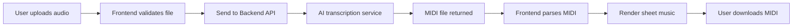

# 🎵 Audio to MIDI Frontend

**Created by Sergie Code - AI Tools for Musicians**

A modern React frontend application that converts audio files into MIDI and visualizes the results as interactive sheet music. This application works in conjunction with the [audio-to-midi-backend](https://github.com/sergiecode/audio-to-midi-backend) service to provide a complete audio-to-MIDI transcription solution.

## 🎯 Project Overview

This frontend application provides a user-friendly interface for:
- **Audio File Upload**: Drag & drop or click to upload audio files (WAV, MP3, FLAC, M4A)
- **Real-time Transcription**: Send audio to the backend AI service for MIDI conversion
- **Sheet Music Visualization**: Display generated MIDI as interactive sheet music using VexFlow and ABCJS
- **MIDI Download**: Download the generated MIDI files for use in other music software
- **Backend Status Monitoring**: Real-time connection status with the transcription service

## 🛠️ Technology Stack

- **Frontend Framework**: React 18 with Vite
- **Styling**: Tailwind CSS for modern, responsive design
- **Sheet Music Rendering**: 
  - [VexFlow](https://github.com/0xfe/vexflow) - Modern music notation
  - [ABCJS](https://github.com/paulrosen/abcjs) - Traditional music notation
- **MIDI Processing**: [@tonejs/midi](https://github.com/Tonejs/Midi) for MIDI file parsing
- **File Upload**: [react-dropzone](https://github.com/react-dropzone/react-dropzone) for drag & drop functionality

## 🏗️ How It Works Together with the Backend



### Integration Points

1. **Backend Health Check**: `GET http://localhost:5000/health`
2. **Supported Formats**: `GET http://localhost:5000/supported_formats`
3. **Audio Transcription**: `POST http://localhost:5000/transcribe`

The frontend automatically handles:
- File format validation based on backend capabilities
- Error handling and user feedback
- MIDI parsing and sheet music rendering
- Real-time backend status monitoring

## 📦 Installation Instructions

### Prerequisites

- **Node.js** (version 18 or higher)
- **npm** or **yarn** package manager
- **Backend Service**: The [audio-to-midi-backend](https://github.com/sergiecode/audio-to-midi-backend) must be running

### Step 1: Clone and Install

```bash
# Clone the repository
git clone https://github.com/sergiecode/audio-to-midi-frontend.git
cd audio-to-midi-frontend

# Install dependencies
npm install
```

### Step 2: Environment Configuration (Optional)

Create a `.env` file in the root directory to customize the backend URL:

```env
VITE_API_BASE_URL=http://localhost:5000
```

**Note**: The frontend defaults to `http://localhost:5000` if no environment variable is set.

## 🚀 Running the Frontend Locally

### Step 1: Start the Backend Service

First, ensure the backend service is running. Follow the instructions in the [audio-to-midi-backend repository](https://github.com/sergiecode/audio-to-midi-backend):

```bash
# In the backend directory
python app.py
```

The backend should be accessible at `http://localhost:5000`

### Step 2: Start the Frontend Development Server

```bash
# In the frontend directory
npm run dev
```

The frontend will be available at:
- **Local**: http://localhost:5173
- **Network**: Available on your local network for mobile testing

### Step 3: Test the Integration

1. **Check Backend Status**: The header should show "🟢 Backend Online"
2. **Upload Audio File**: Drag & drop or select a WAV, MP3, FLAC, or M4A file
3. **View Results**: See the generated sheet music and download the MIDI file

## 🧪 Testing the Integration

### Test Files

Use these types of audio files for best results:
- **Piano recordings**: Clean, single-note melodies work excellently
- **Guitar recordings**: Fingerpicked or clean electric guitar
- **Vocal melodies**: Clear, single-voice recordings
- **Simple instrumental**: Flute, violin, etc.

### Expected Workflow

1. **File Upload** → File validation and backend communication
2. **Processing** → Real-time progress indication while backend processes
3. **Results** → Sheet music display with both ABCJS and VexFlow options
4. **Download** → MIDI file download for external use

### Troubleshooting

| Issue | Solution |
|-------|----------|
| "🔴 Backend Offline" | Ensure backend is running on `http://localhost:5000` |
| "File too large" | Use files under 50MB |
| "Unsupported format" | Use WAV, MP3, FLAC, or M4A files |
| "Network error" | Check firewall and CORS settings |

## 🔧 Available Scripts

```bash
# Development server
npm run dev

# Build for production
npm run build

# Preview production build
npm run preview

# Lint code
npm run lint
```

## 📁 Project Structure

```
src/
├── components/           # React components
│   ├── BackendStatus.jsx    # Backend connection status
│   ├── FileUploader.jsx     # Drag & drop file upload
│   ├── SheetMusicViewer.jsx # Main sheet music display
│   ├── ABCJSViewer.jsx      # ABCJS notation renderer
│   └── VexFlowViewer.jsx    # VexFlow notation renderer
├── services/            # Business logic
│   ├── apiService.js        # Backend API communication
│   └── midiProcessor.js     # MIDI parsing and conversion
├── App.jsx              # Main application component
├── main.jsx             # Application entry point
└── index.css            # Tailwind CSS styles
```

## 🎨 Customization Options

### Styling

The app uses Tailwind CSS with a music-focused color scheme:
- **Primary Colors**: Blues and purples for a musical aesthetic
- **Accent Colors**: Gold/yellow for active states
- **Components**: Pre-styled components in `src/index.css`

### Sheet Music Libraries

Switch between notation libraries:
- **ABCJS**: Best for traditional music, folk tunes, simple melodies
- **VexFlow**: Best for complex notation, jazz, contemporary music

### Backend Configuration

Modify `src/services/apiService.js` to:
- Change API endpoints
- Add authentication
- Customize error handling
- Add request timeouts

## 🚀 Expanding the Application

### Current Placeholder Logic

The following components contain basic implementations that can be enhanced:

#### MIDI to Sheet Music Conversion
**File**: `src/services/midiProcessor.js`

**Current**: Basic note mapping and duration handling
**Expansion Ideas**:
```javascript
// Add support for:
- Chord recognition and display
- Multiple tracks/voices
- Key signature detection
- Time signature changes
- Tempo markings
- Dynamics and articulations
```

#### VexFlow Rendering
**File**: `src/components/VexFlowViewer.jsx`

**Current**: Simple note display (first 8 notes)
**Expansion Ideas**:
```javascript
// Add support for:
- Multiple measures
- Chord notation
- Beam groupings
- Ties and slurs
- Multiple staves
- Percussion notation
```

#### ABCJS Rendering
**File**: `src/components/ABCJSViewer.jsx`

**Current**: Basic ABC notation rendering
**Expansion Ideas**:
```javascript
// Add support for:
- Multiple parts/voices
- Chord symbols
- Lyrics integration
- Ornaments and symbols
- Custom styling options
```

### Adding New Features

#### Audio Playback
```javascript
// Add to components:
import WaveSurfer from 'wavesurfer.js';

// Implement waveform visualization
// Add play/pause controls
// Sync playback with sheet music highlighting
```

#### MIDI Playback
```javascript
// Add MIDI player:
import MidiPlayer from 'midi-player-js';

// Implement MIDI playback controls
// Sync with sheet music highlighting
// Add tempo and volume controls
```

#### Real-time Recording
```javascript
// Add microphone recording:
navigator.mediaDevices.getUserMedia({ audio: true })
// Implement real-time transcription
// Add recording controls and waveform display
```

#### Export Options
```javascript
// Add export features:
- PDF export using jsPDF
- MusicXML export
- Audio file generation from MIDI
- PNG/SVG export of sheet music
```

### Production Deployment

#### Environment Variables
```env
VITE_API_BASE_URL=https://your-backend-domain.com
VITE_APP_TITLE=Your Custom Title
VITE_GA_TRACKING_ID=your-analytics-id
```

#### Build Optimization
```javascript
// vite.config.js
export default {
  build: {
    rollupOptions: {
      output: {
        manualChunks: {
          vendor: ['react', 'react-dom'],
          music: ['vexflow', 'abcjs', '@tonejs/midi']
        }
      }
    }
  }
}
```

## 🤝 Contributing

This project is part of the **Sergie Code** educational series on AI tools for musicians. Contributions are welcome!

### Areas for Contribution
- Enhanced MIDI to sheet music conversion algorithms
- Mobile app version (React Native)
- Additional music notation features
- Performance optimizations
- Accessibility improvements

## 📚 Educational Resources

Created as part of the **Sergie Code** YouTube channel content:
- **Topic**: AI Tools for Musicians and Developers
- **Focus**: Practical applications of AI in music technology
- **Audience**: Musicians interested in technology, developers interested in music

### Related Content
- Backend API development with Python and AI
- MIDI processing and music theory
- React frontend development
- Music notation libraries and web audio APIs

## 🔗 Links

- **Backend Repository**: [audio-to-midi-backend](https://github.com/sergiecode/audio-to-midi-backend)

- 📸 Instagram: https://www.instagram.com/sergiecode

- 🧑🏼‍💻 LinkedIn: https://www.linkedin.com/in/sergiecode/

- 📽️Youtube: https://www.youtube.com/@SergieCode

- 😺 Github: https://github.com/sergiecode

- 👤 Facebook: https://www.facebook.com/sergiecodeok

- 🎞️ Tiktok: https://www.tiktok.com/@sergiecode

- 🕊️Twitter: https://twitter.com/sergiecode

- 🧵Threads: https://www.threads.net/@sergiecode

---

**Built with ❤️ by Sergie Code - Teaching programming and AI tools for creativity**+ Vite

This template provides a minimal setup to get React working in Vite with HMR and some ESLint rules.

Currently, two official plugins are available:

- [@vitejs/plugin-react](https://github.com/vitejs/vite-plugin-react/blob/main/packages/plugin-react) uses [Babel](https://babeljs.io/) for Fast Refresh
- [@vitejs/plugin-react-swc](https://github.com/vitejs/vite-plugin-react/blob/main/packages/plugin-react-swc) uses [SWC](https://swc.rs/) for Fast Refresh

## Expanding the ESLint configuration

If you are developing a production application, we recommend using TypeScript with type-aware lint rules enabled. Check out the [TS template](https://github.com/vitejs/vite/tree/main/packages/create-vite/template-react-ts) for information on how to integrate TypeScript and [`typescript-eslint`](https://typescript-eslint.io) in your project.
